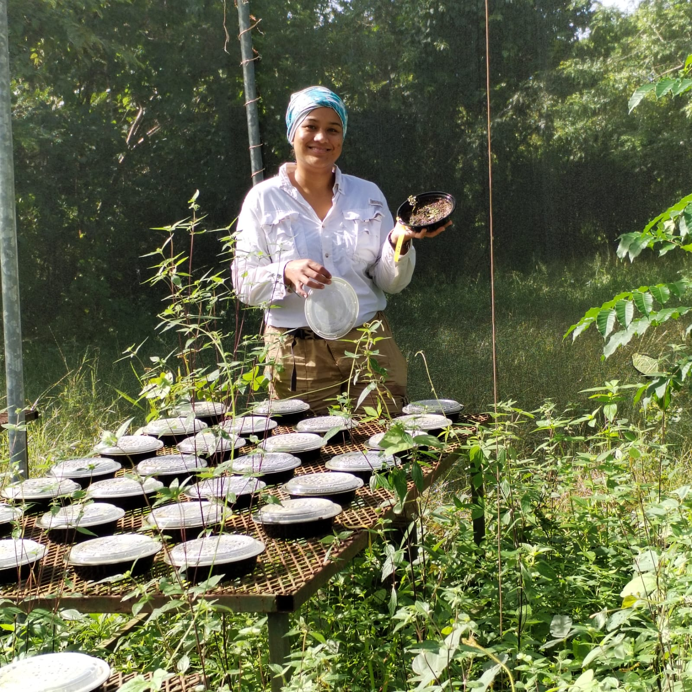

::: {style="width: 400px; height: 400px; overflow: hidden; border-radius: 50%; display: block; margin-left: auto; margin-right: auto;"}

:::

------------------------------------------------------------------------

I am a Colombian Caleña plant ecologist. I graduated as a Biologist from Universidad del Valle (Cali, Colombia). I got my Master's in Biological Sciences from Universidad de los Andes (Bogotá, Colombia). Since the beginning of my career, I have been studying tropical dry forests, initially in Colombia. Currently, during my PhD, I am also exploring the Costa Rican dry forests.

I have always been passionate about plants. I love learning about its taxonomy, natural history, ecology, and physiology. Currently, my research focuses on understanding how the abiotic environment limits the seed and seedling stages in tropical dry forest species.

To learn more about my career, please check out [my CV](pdfiles/CV_VLL.pdf).

#### AI and Editorial Process Transparency

As I advocate for the responsible and proper use of AI to create any kind of content, I want to be open about how I use AI for this website. I built my website using R Markdown code. For my Tropical Seedologist blog posts, I write the content based on years of knowledge gained from studying seeds and seedlings through my experiments. I then use AI tools like Grammarly and Gemini to correct grammar and spelling errors, as English is not my first language. I also have prompts for them to act as editors, flagging things as scientific jargon or if I exceed a certain word limit. I also use Gemini and ChatGPT to help me edit code that is not working or understand how to use a specific command. I use these tools as a helpful editor, and I always check and review any changes made by these tools in any of my writing or code. My husband and one of my best friends, both scientists (not seed scientists, tho), are also my editors.
