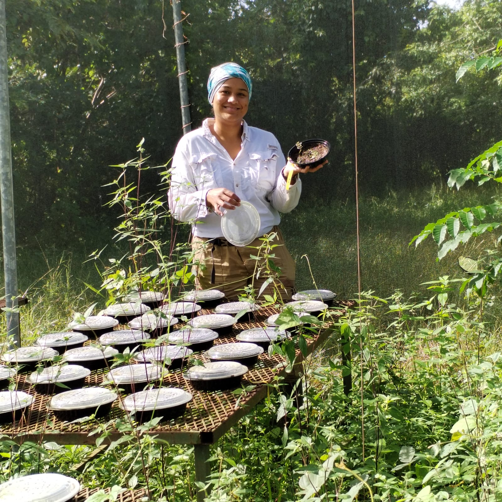

I am a Colombian seed ecologist. I graduated as a Biologist from Universidad del Valle (Cali, Colombia) and got my Master's in Biological Sciences from Universidad de los Andes (Bogotá, Colombia). Since the beginning of my career, I have been studying tropical dry forests, initially in Colombia, and currently, during my PhD, I am also exploring the Costa Rican dry forests.

I have always been passionate about plants. I love learning about its taxonomy, natural history, ecology, and physiology. Currently, my research focuses on understanding how the abiotic environment limits the seed and seeding stages in tropical dry forest species.

If you want to learn more about my career, please check out [my CV](pdfiles/CV_VLL.pdf).

.
