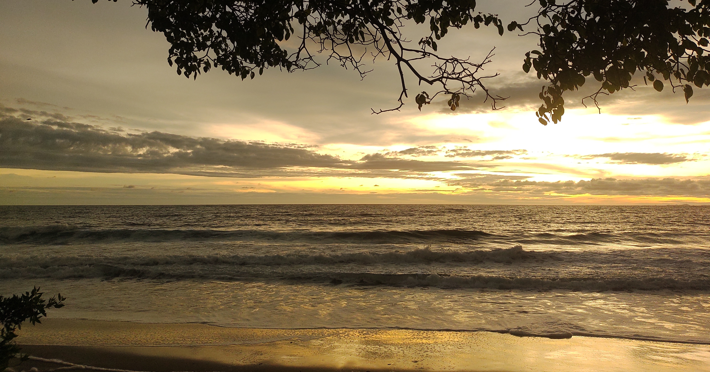

Welcome to **Tropical Seedologist**, a blog where I share stories about
my journey to becoming a tropical seed scientist. I want to show you the
fascinating world of seeds so that we can all become as interesting as
seedologists are (at least, in my opinion!).

Each month, I will post a short blog entry in both English (and soon in
Spanish too). I'm excited you're here! If any of these stories resonate
with you, or if you have a question or a project related to seeds,
seedlings, natural regeneration, or forest restoration, please don't
hesitate to reach out. I'd love to hear your story, too! You can find my
contact information on the [contact](contact.html) tab.

*A Quick Tip:* If you're new to the blog, I highly recommend starting
with the first post at the bottom of the page and reading in order. If
you came here looking for a specific definition, head straight to our
Seed Jargony sections, which you'll find throughout the blog.

Now, let's start one seed at a time!

------------------------------------------------------------------------

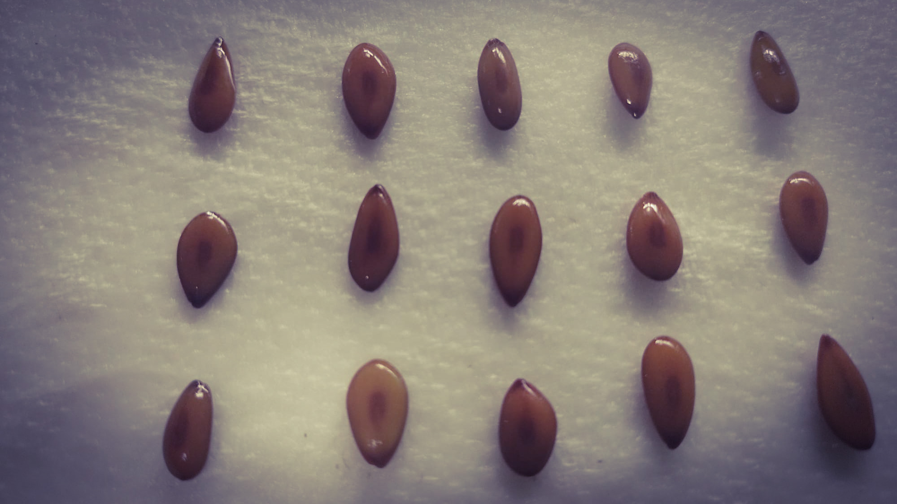

## Seed jargony V: Micropyle

*December, 2025*

I’m going to keep this one simple because it’s December—we need to close out the year and be merry with whoever we call family. Also, my computer recently broke, which means spending a big chunk of time choosing a replacement, but it’s actually a bit of a silver lining because now I know exactly what I want for Christmas!

Anyway, last time in this section, we talked about an aperture or opening in the seed coat that acts like a scar: the belly button of the seed, the hilum. However, in that seed coat, there are more than just scars; there are also tiny holes. One of those is the micropyle.

The micropyle is an opening formed by the layers of tissue that surround the ovule (remember: a seed is essentially a fertilized ovule). These protective layers are called integuments (or teguments). They protect the ovule’s nuclei, which contain the genetic material from the "mother" plant.

During fertilization, the pollen tube reaches the nuclei of the ovule through this small opening. Even after the seed is fully formed, the micropyle remains in many species, usually located right next to the hilum. In other seeds, it becomes completely blocked once the seed coat is fully developed.

Go and look for this tiny hole! If you have a bean seed nearby, it should be right there.

Happy holidays, and enjoy what is left of 2025. See you in January!

------------------------------------------------------------------------

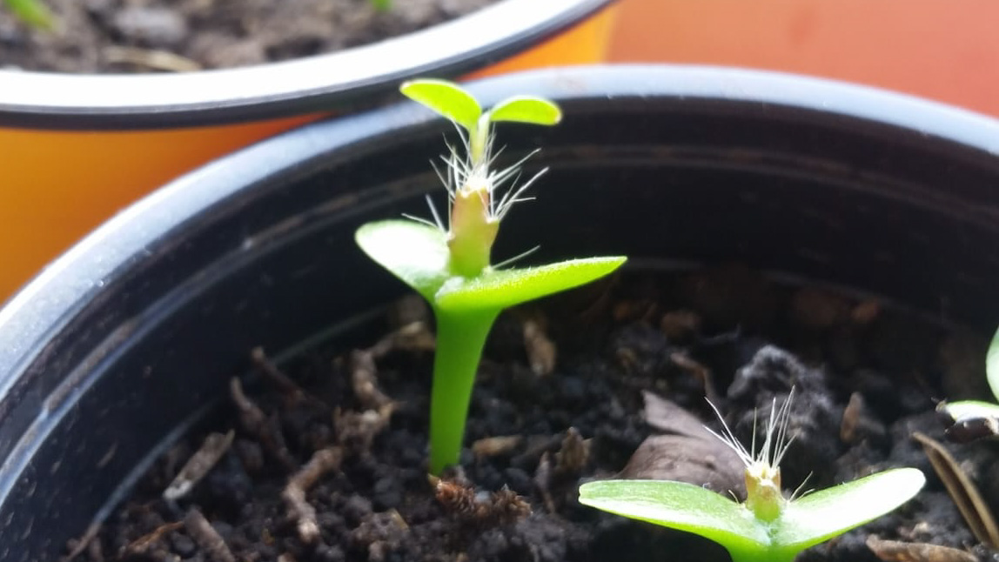

## How to germinate: Part II

*November, 2025*

Keeping up with this series of instructions, see this as a handbook on how plants germinate. A key aspect is how seedlings—the newborns—decide to emerge from the seed. As you might imagine, scientists have developed names for what appears to be a simple action, yet is crucial for a plant's life: emergence.

There are two main philosophical branches—can I say cotyledons, or does it sound too much like a dad joke?—regarding how to emerge: hypogeal and epigeal germination.

In hypogeal germination, the cotyledons stay below (hypo) ground (gea). The upper part of the seedling stem (the epicotyl, which will have its own Seed Jargony section soon) elongates and pushes up the first true leaves and shoot, called the plumule. This means plants with hypogeal germination keep their cotyledons underground as a food source while the seedling grows. A classic example is the pea.

On the other hand, in epigeal germination, the part below the cotyledons (the hypocotyl) elongates and pushes the cotyledons above (epi) ground (gea). After this, the cotyledons expand and become green and photosynthetic, looking like real leaves. Eventually, the "true" leaves appear, and after some time, the cotyledons fall off. A great example of this is the bean.

In other words, the two main strategies are to either keep your cotyledons down or bring them up. Notice how both examples (peas vs. beans) are from the same family. This suggests that these mechanisms tell us more about ecological strategies—how to survive where you live—than just taxonomy. Are you relying on your cotyledons to start photosynthesis immediately, or are you keeping them safe underground as a backup? That is the story I plan to tell in How to Germinate: Part III.

A final consideration: I used the "usual suspects" for these names, but there are even nerdier terms! When cotyledons are fully exposed from the seed coat, it’s called phanerocotylar (phaenos meaning visible)—common in epigeal plants. When they remain hidden in the seed coat, it’s cryptocotylar. These technical terms cover more ground because, as usual, plants are too complex to be encapsulated in just two worlds. If you don’t believe me, go check how the Durian germinates: is it epigeal or hypogeal?

See you in December!

------------------------------------------------------------------------

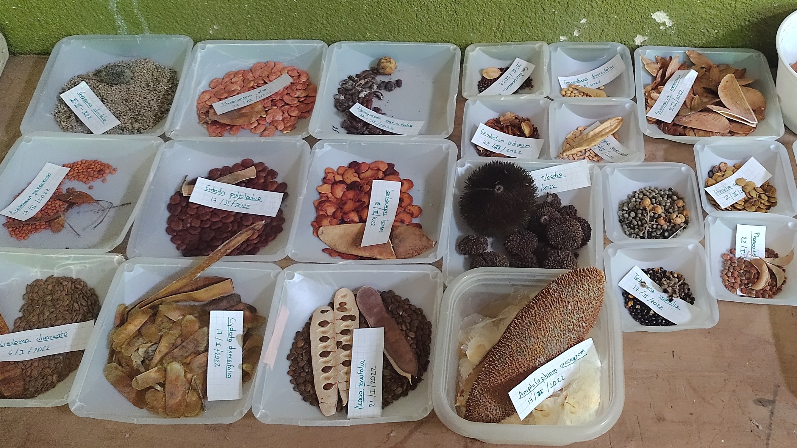

## Seed jargony V: Hilum

*October, 2025*

Remember when I told you that seeds are like baby plants? In that sense,
they also have the first scar every human baby has: a belly button! In
the seed's case, this scar is called the hilum. The hilum is precisely
the scar on the seed where it was attached to its "mum's" ovary wall or
the funicle (AKA, the umbilical cord). This feature reinforces the
concept of treating seeds and fruits as integral parts of a plant's
reproductive cycle and as key subjects for studying a plant's
reproductive strategies. The hilum comes in many sizes, shapes, and
colors, and as you'd expect, it's more noticeable in large seeds.
Differences in hilum shapes can even help you identify species or groups
of species!

Now, it's time to cure your plant blindness again! Take a seed or
two---no excuses, they aren't hard to find. Hold it in your hand and try
to identify where the hilum is located. Is it noticeable or not? In some
seeds, you may also notice another opening. "What? More than one hole?!"
you might think. This is only because you haven't observed nature in
detail, and yes, because in some seeds there might be more than one
opening. The other one is the micropyle, which is the place through
which the pollen tube arrives at the ovule. In some cases, the micropyle
is noticeable, and in others, it is not. We'll talk about that in the
next Seed Jargony section.

So now you know more than you did before! And if that doesn't impress
anyone, then they might be very boring. Happy Halloween, and see you in
November!

------------------------------------------------------------------------

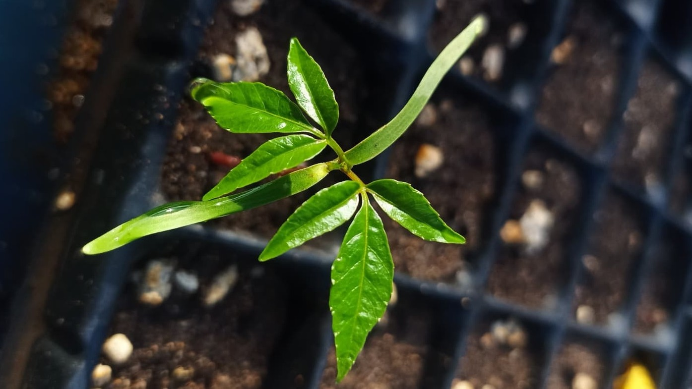

## How to germinate: Part I

*September, 2025*

We've arrived at the most decisive part of any plant's life:
germination. It's an irreversible process---once a seed starts, it can't
be reversed, and growth won't stop until death. That's why plants take
this so seriously; they can't just germinate anywhere. Today, we'll
focus not on the decision-making process, but on the three main phases
of germination itself: imbibition, the lag phase, and radicle
protrusion.

The first phase, imbibition, is when a seed rapidly takes in water. The
seed's tissues have a high solute potential and are ready to be hydrated
through osmosis. As soon as the tissues are hydrated, the second phase,
or lag phase, begins. In this phase, the rehydrated tissue awakens the
entire seed's metabolism. Hormones, enzymes, and metabolic pathways all
"fire up" the engines for what's to come.

The final phase is radicle protrusion. The embryo begins to grow by
expanding its cells, and its embryonic root (radicle) breaks through the
seed coat. It's important to pause here and reflect on this: the embryo
doesn't increase in size through cell division, but through expansion.
This means the embryo has been ultra-compressed and tightly packed all
along, and its life begins by simply "unwrinkling" and expanding. There
are many ways it does this, but we'll explore those later.

As mysterious and abrupt as it sounds, this process is controlled by
many other factors that we'll explore in the following posts! See you in
October!

------------------------------------------------------------------------

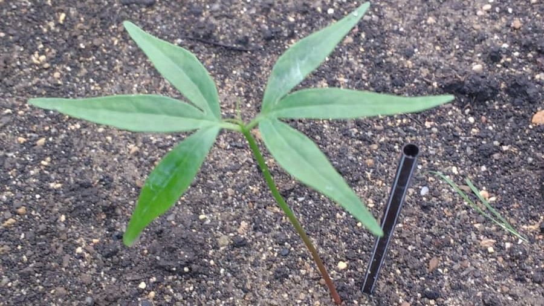

## Seed jargony IV: Cotyledons

*August, 2025*

Cotyledons are among the first structures to emerge when a seed
germinates. They are a part of the embryo that stores the nutrients the
embryo uses during its first stages of development.

Unlike the endosperm, cotyledons are an integral part of the embryo
itself, and their function becomes essential once germination begins.

-   Nutrient storage: This is their primary function. Since they hold
    the food reserves the embryo absorbed while growing, they keep this
    nourishment until germination, allowing the embryo to develop its
    first parts.

-   Nutrient absorption: Other cotyledons facilitate the transfer of
    nutrients from the endosperm to the embryo. The scutellum in many
    monocots, for example, is a specialized cotyledon that serves this
    purpose.

-   Photosynthesis: Some cotyledons emerge above ground and act as the
    first pair of leaves, or "seed leaves," ready to start making food
    through photosynthesis. Other cotyledons stay inside the soil,
    providing nutrients as needed.

Cotyledons, much like seeds, give their name to a major subdivision of
the Angiosperms: the monocots (with just one cotyledon, like grasses)
and the dicots (with two cotyledons, like beans). I should clarify that
these are merely morphological classifications and don't necessarily
reflect the evolutionary history of the species.

We'll be talking more about cotyledons in the future when we discuss the
different kinds of germination. See you in September!

------------------------------------------------------------------------

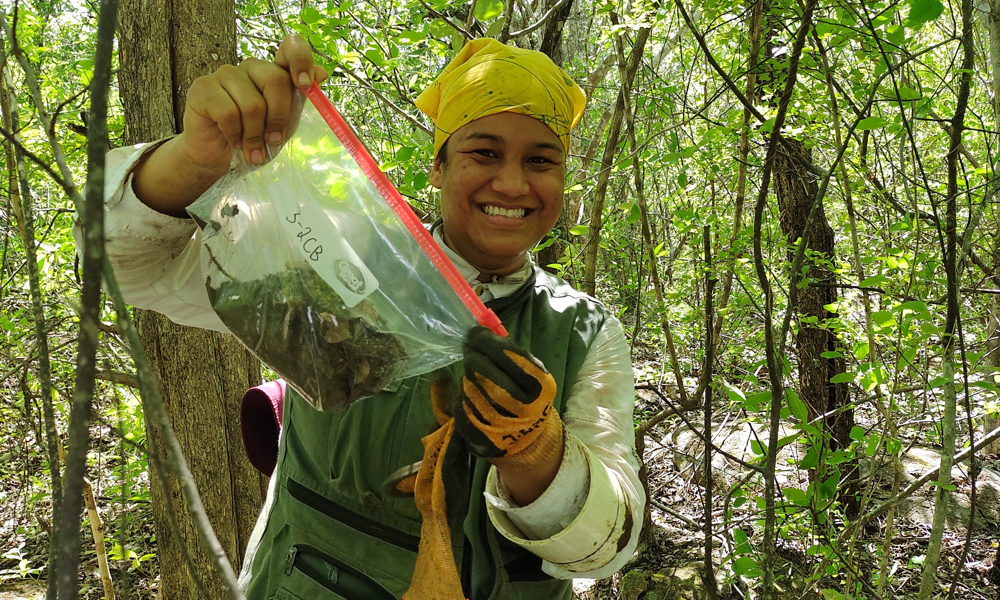

## A forest's savings account

*July, 2025*

Did you know that plant communities have savings for the future? They
do! They're not too concerned about financial institutions, so they
simply bury their savings in the soil like a pirate's treasure. This
treasure is called the soil seed bank.

This month, we'll take a small step away from morphology and physiology
to talk about some of the ecological roles seeds play. The soil seed
bank is a storage of viable (or, in other words, alive) seeds from
different plants within a forest.

Similar to a savings account, the soil seed bank has incomes that come
from the dispersal of adult plants. It also has investments, as some
seeds germinate into seedlings, and losses, as some seeds die because
they've reached the end of their survival limit or because they're eaten
by predators or infected by pathogens like fungi or bacteria. This
storage is fundamental for the future of the forest because it helps
ensure that a proportion of seeds from different species in the
community will germinate.

I realize that the term "plant community" is a key element here. Think
of a plant community like a neighborhood. Picture each species as a
different family, living together in an area with the right conditions
for their survival. In this sense, each type of forest has a set of
species that live in it. When these different species disperse their
seeds, some germinate, some die, and some are kept in the soil seed
bank.

There are two main strategies when it comes to the soil seed bank.
Persistent species are those that can remain as viable seeds in the soil
for more than a year. In contrast, transient species are those that only
wait for the next germination season (whether it's rainy, fall, or
spring, depending on the ecosystem) to sprout.

Do you have savings? Don't worry, I won't pry! That's it for today. See
you in August!

------------------------------------------------------------------------

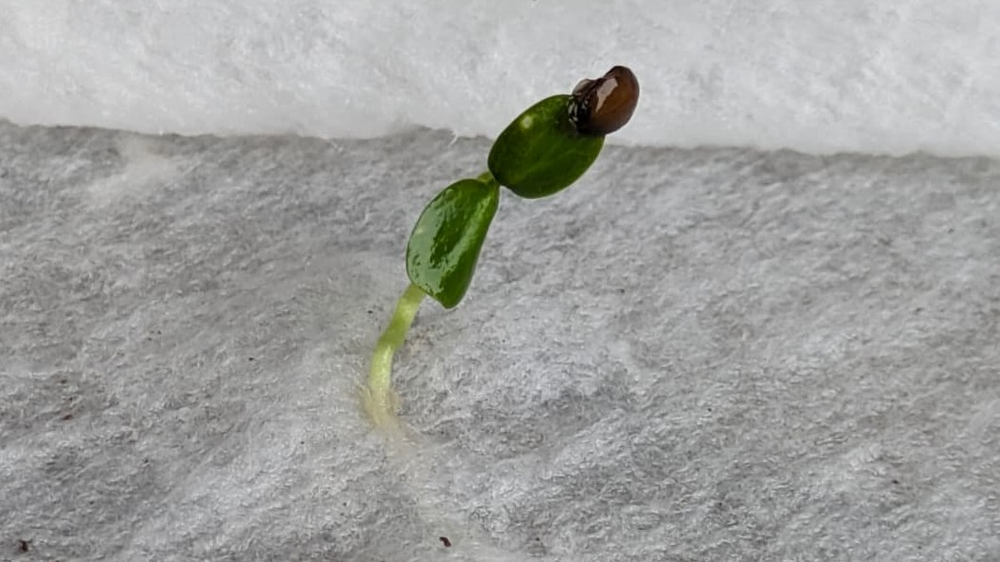

## Seed jargony III: Endosperm and other nutritious tissues

*June, 2025*

We have a couple of distinctions to make according to our two groups of
seed plants. That's right, Angiosperms and Gymnosperms do not have the
same kind of nutritious tissue for their seeds. But don't worry, both
nourish their seeds properly!

Let's start with Gymnosperms. Gymnosperms have a nutritious tissue
formed by the body of the cone-bearing plant. Since this tissue is
formed from the female gamete (or gametophyte, as I mentioned earlier),
it is haploid, meaning it only bears half of the genetic information
(unlike us, who are diploid). Once fertilization occurs, the Gymnosperm
embryo takes its nutrients from that gametophyte tissue. This is because
they don't have the double fertilization process that Angiosperms do.

On the other hand, the double fertilization of Angiosperms forms the
endosperm. The endosperm is created by the fusion of one of the pollen
nuclei with two nuclei from the female ovule. The endosperm is
incredibly important because it provides nutrients to the embryo as it
grows.

Now, there are two kinds of plants in this sense... and then there are
the orchids. The first kind is like the bean, where the embryo
completely absorbs the endosperm while the seed is developing. By the
time of dispersal, there is no endosperm left; it's all incorporated
into the embryo and stored in the cotyledons (I'll explain these in a
later session). These are called non-endospermic or exalbuminous seeds.

The other kind is like a corn kernel, where the embryo only uses the
endosperm when germination occurs, and most of the seed is endosperm. In
fact, what you pop to make popcorn is the endosperm, as is
cornstarch---just saying! These seeds are called endospermic or
albuminous seeds.

And then there are the orchids. Sorry, orchid lovers, but these guys
don't invest much in their offspring. Neither their embryo nor their
endosperm is well-developed, so they rely on a fungal association to be
able to germinate.

That's it for today. See you in July!

------------------------------------------------------------------------

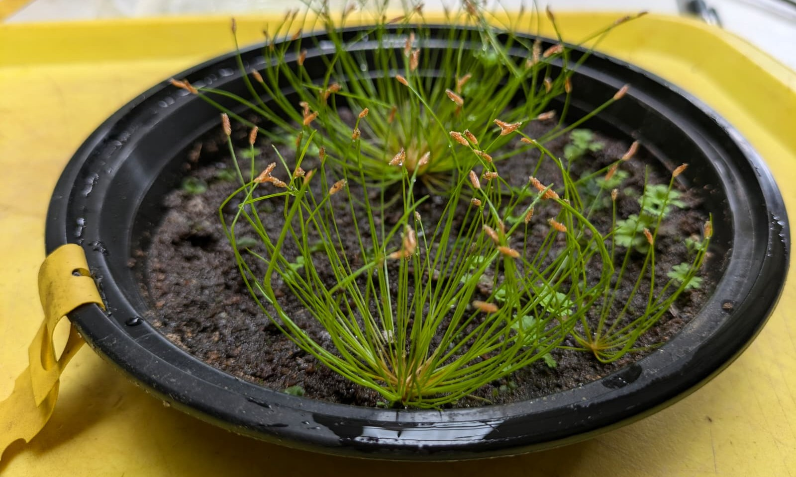

## Special relativity and the seed dispersal

*May, 2025*

When I first defined the seed, I mentioned that seeds were like "time
machines" and "space vehicles." This is because one of their main
functions is dispersal. Dispersal is precisely what it sounds like: the
movement of a seed away from the parent plant. As a plant, you can't
move, but you can move your future generations and your genes with your
seeds!

This movement can occur in both space and time, as Albert Einstein's
theory of special relativity proposes. To move in space, plants have
equipped their fruits and seeds with special features that help them
find new horizons. Here are some of the most common types of dispersal,
because yes, with this topic, we can get as detailed as we want!

-   **Anemochory:** Wind-dispersed seeds. These seeds have wings,
    feathers, hairs, or aerodynamic shapes that allow them to fly or
    glide through the air.

-   **Zoochory:** Animal-dispersed seeds. There are two main kinds:
    those that travel inside the animal (endozoochory) and those that
    travel outside (ectozoochory). For endozoochory, picture a fruit
    that's eaten and then... pooped out somewhere else. For
    ectozoochory, picture those little seeds that stick to your pants
    when you go hiking.

-   **Autochory:** Self-dispersed seeds. These plants didn't make a
    fruit but rather an explosive device, a catapult, or something that
    can't be reached easily. This type also includes seeds that are
    dispersed by gravity (a fancy way of saying they just fall from the
    tree).

-   **Hydrochory:** Water-dispersed seeds. These are the ones with
    flotation devices that allow them to cross entire oceans.

These are just a few common types of dispersal in space, and you can
imagine that a seed can travel as far as another continent if the
conditions are right.

The other category of dispersal is in time. Many species achieve this
thanks to their dormancy---a concept we'll explore later, but it's
basically the ability to wait. And believe me, seeds can wait for a
long, long time. The oldest seed to have ever germinated was 32,000
years old! This means that many generations of its family passed, and
yet it kept its genes intact and ready to grow for over three
ten-thousands of years. Honestly, Einstein should have studied seeds.

That's it for this month. I hope you've learned and enjoyed it. See you
in June!

------------------------------------------------------------------------

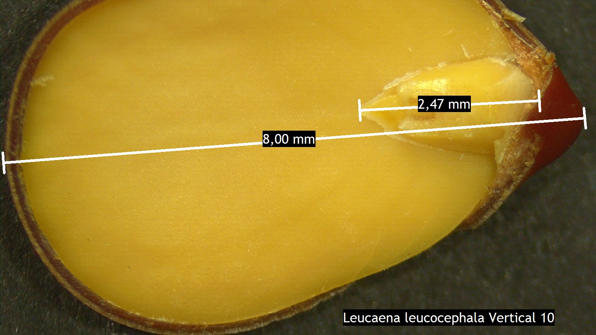

## Seed jargony II: Seed embryo

*April, 2025*

Let's continue with our Jargony section by properly defining the baby
plant, or embryo. I'll just call it "embryo" from now on!

The embryo is the result of the union between two plant gametes: the
ovule and the pollen. The ovule is like a human ovum, and pollen is like
human sperm. These two join together through a process called
pollination. In Gymnosperms (think conifers), pollination is usually
carried by the wind. In Angiosperms (flowering plants), it can be
carried by anything you can think of: wind, water, a bee, a bat, a fox,
you, or me!

Once fertilization happens, the embryo begins its initial development
inside the maturing seed. By the time the seed is mature enough to
disperse from the plant, embryos can vary greatly among species. Some
species have embryos that grow to fill the entire seed, while others
have embryos that only partially occupy the seed. Others, like orchids,
have extremely underdeveloped embryos at the time of dispersal.

These differences mean that each species has a unique germination
strategy. Some seeds are almost ready to grow right away, while others
need time to use their stored nutrients before they can begin to grow.
When we explore germination later, I'll go into detail about the
exciting transition from an embryo to a seedling.

I hope you learned something today! See you in May.

------------------------------------------------------------------------

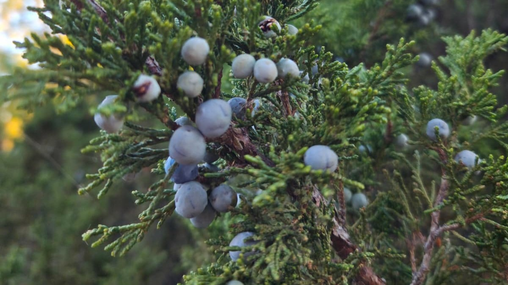

## Contained vs. naked seeds

*March, 2025*

One of the many things I left hanging from previous posts is the mention
of the two main plant groups that have seeds: the Gymnosperms and the
Angiosperms. In a strict evolutionary sense, both came up with a
different version of what a seed is, but they both contain the three
main parts: a coat, an embryo, and a food supply. Let's briefly explore
these two groups and their fascinating seeds.

Angiosperms, which Charles Darwin called "the abominable mystery," are
the real winners. They've established themselves in a vast variety of
environments (the only vascular plant living in Antarctica is an
Angiosperm---a grass, no less!). These famous flowering plants have
evolved a very complex method of reproduction called double
fertilization, which results in a contained, not naked seed.

Let's talk about flowers and sex. In Angiosperms, the ovule is contained
within the ovary of the flower. When pollen arrives, it contains more
than one nucleus (plant cells are on another level when it comes to
genetic charge; instead of just two copies like us humans, they can have
up to eight!). One part of the pollen fuses with a nucleus in the ovule
to form the baby's lunch (called the endosperm in some plants), while
the other part forms the embryo itself. This double fertilization
happens inside the ovary, which then develops into the fruit. The fruit
acts as a container, which is essential for our next
topic---dispersal---because it provides extra structures that not only
protect the seed but also help it reach the most remote places in the
world, such as Antarctica.

Although Gymnosperms came first in evolutionary history, I prefer to
explain them after Angiosperms because they "lack" something---and the
only way to define a lack is by knowing what it's missing. Gymnosperms
are the famous pines, firs, and redwoods---the oldest, tallest, and
widest trees on our planet. A key trait is that most of them form cones,
hence their other common name: Conifers.

Conifer seeds are the naked seeds. This is because their embryo is not
contained in an ovary; it just lies there, exposed on one of the scales
of the cone. The nutritious part of these conifer seeds---their
lunch---is formed from their mother's tissue (called the female
gametophyte, if you want to sound more sophisticated... but let's not).
Since this food supply comes only from the mother, it has a distinct
genetic makeup compared to the embryo.

In both cases, my main message is that a seed is a multigenerational
structure. It contains parts from the parents and a new plant
generation. It's like seeing a pregnant person, but zipped!

As always, I hope you're a little more aware of plants now. See you next
month.

------------------------------------------------------------------------

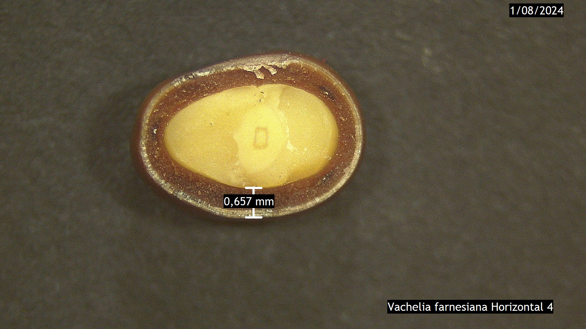

## Seed jargony I: Seed coat

*February, 2025*

New year, new blog section! In these "Seed Jargony" entries, we'll
explore some fundamental concepts in seed biology. Let's start with the
seed coat.

As I mentioned before, one of the key parts of a seed's definition is
its coat. You can picture it like a human coat or clothing: a protective
layer that covers the most essential parts, shielding them from the
outside world.

Just as each country has its own typical costume, each plant species has
its own unique seed coat. Some are hard and waterproof; others are
delicate and paper-thin. The main role of the seed coat is to protect
the embryo (the baby plant) from external threats like diseases or
abrasion from the soil.

However, the seed coat has another crucial role: it acts as a sensor for
the environment, telling the seed when to germinate. We'll explore
germination later, but it's important to know that when germination
occurs, the seed coat releases hormones that help the embryo absorb the
nutrients its "mom" saved for it.

And just like when you were a child and eventually outgrew your
favourite clothes, seeds also shed their coats. Some break down the coat
as they grow, while others simply let it fall unceremoniously into the
soil, where it becomes part of the ecosystem.

I hope this definition gives you a clearer picture of the seed coat. See
you in March!

------------------------------------------------------------------------

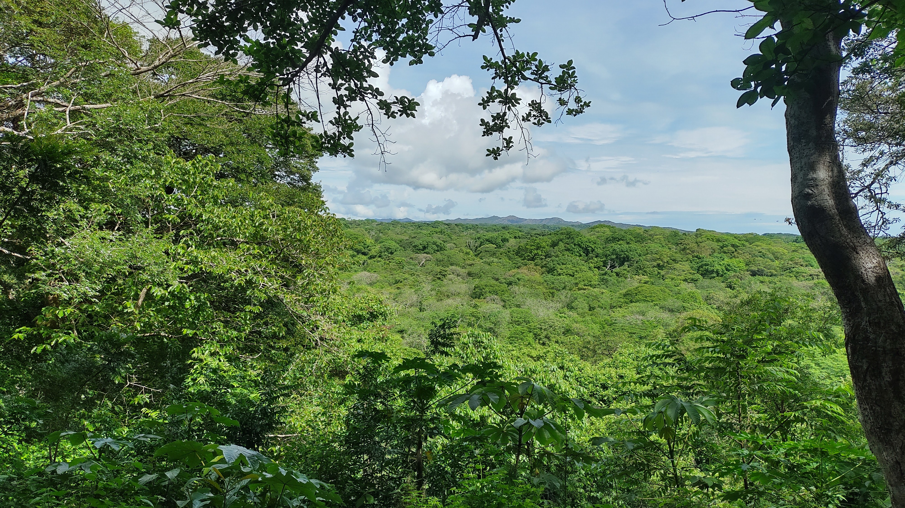

## Why should you care about the biology of seeds and seedlings?

*January, 2025*

Happy New Year!

I was reflecting on how to start the blog this year. Although I promised
the "Seed Jargony" section, I realized I haven't properly explained why
these seeds and seedlings matter so much. This is particularly crucial
to me, as the main goal of this blog is to connect the general public to
the fascinating science of seeds.

This topic goes far beyond biology classes. Think about it: most of our
food, clothing, and even our houses come from plants --- and plants
begin with seeds. Human history itself is tightly linked to seeds: when
early humans shifted from nomadic lifestyles to farming, it was because
they learned to study and manage seeds. That discovery --- agriculture
--- shaped civilisation as we know it.

Early humans realized they needed to understand seeds to domesticate
plants and make them grow when and where they were needed. We now know a
lot about the commercially used plants, but we still have hundreds of
thousands of species that could potentially be used to heal our planet.
These are the plants that interest me, especially the ones that can help
us restore our forests.

As humans, we sometimes forget that we are part of nature and, as a
result, don't always use it in a way that ensures its long-term
survival. This has happened to the very forests that provide the oxygen
we breathe, the food we eat, and the materials for our homes. We should
be more interested in recovering these ecosystems so they can continue
to thrive and provide for us. After all, we live in a mutualistic
relationship with nature.

That is why I study the seeds and seedlings of species that are often
ignored, especially those in tropical forests. I want to understand how
they continue to exist, grow, and face environmental hardships in their
stationary way of living. Maybe this sounds too romantic, but we need to
start appreciating and loving all the living things around us. And the
only way to truly appreciate and love them is to get to know them.

See how I didn't mention seeds much in this post, but I'm sure you're
thinking about them now. As this new year begins and you become more
aware of plants, keep visiting this blog. Get to know them, and I'm sure
you'll love them as much as I do.

Think about it, and I'll see you in February!

------------------------------------------------------------------------

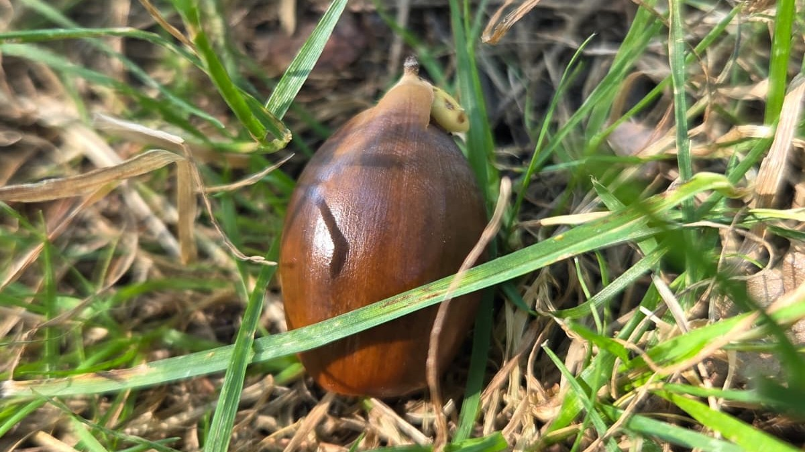

## So... What Is a Seed, Anyway?

*December, 2024*

I know you have been reading this blog for two months, and I haven't
been thorough enough to provide a clear definition of what a seed is. As
a plant biologist, I had to start with the dates and the evolution. It
is also hard to provide an exact definition because seeds are many
things at a time: - A prospective plant - A space vehicle - A time
machine - Multigenerational structure I know that probably leaves you
with more questions than answers. That's what happens when you ask a
scientist for a "clear, not an it-depends" kind of answer.

Don't worry, we'll explore all of these definitions in future posts. But
for now, let's keep it short and sweet. Simply put, a seed is a
potential plant. More technically, it's a fertilized ovule that contains
three main parts:

1.  An embryo (the baby plant)

2.  A food supply (its lunch bag)

3.  An enclosing seed coat (its protective armor)

We'll unpack each of these parts in more detail in a new section of the
blog called "Seed Jargony." Every other month, we'll dive I nto one
piece of seed terminology. Think of it as a growing mini-dictionary you
can come back to whenever you need a refresher.

This post is brief because I want to devote each of those complex
definitions to the attention it deserves in future entries. I promise
that when we explore these ideas, you'll be glad I didn't try to cram
them all into one sentence!

Happy end of the year, and see you next year!

------------------------------------------------------------------------

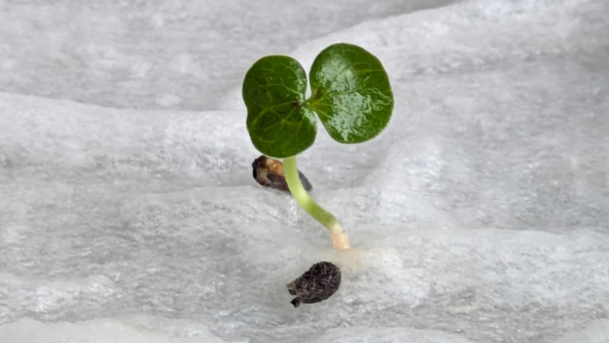

## One seed at a time

November, 2024

Hopefully, after the previous reading, you've started noticing plants,
because today we will begin a unique journey into their wonderful world.
You might wonder why I called it "unique" and "wonderful." Maybe that's
my ego sneaking in (this blog is certainly not unique). But I can
promise you this: their world is wonderful---sometimes in quiet, subtle
ways that words barely capture.

Enough of my rambling. Let's challenge plant blindness with a simple
exercise. Go find a seed. No excuses---it can be cooked, raw, wild, from
a fruit in your fridge, a jar in your cupboard, or even from jewelry.
Hold the seed in your hand and look at it. Would you believe me if I
told you that you're holding a product from a history spanning hundreds
of millions of years?

Approximately 470 million years ago, plants began to explore the land. A
few million years later, around 365 to 400 million years ago, it became
clear that if they wanted to establish and expand effectively, they
needed a solution. That solution was the seed. This dramatic innovation
changed our perception of what a plant is and what it can do.

Seeds were revolutionary. Seeds essentially were and are a "better baby
plant": one that could travel away from its parent (dispersal), carry a
lunch bag of nutrients (nutrition), stay protected from damage and
predators (protection), and decide the best time to grow (dormancy).
That combination was so successful that plants became the dominant life
form we know today.

Seeds shaped the plant kingdom so profoundly that two of its largest
groups are named after the Greek word sperma (seed): angiosperms ("seeds
contained") and gymnosperms ("seeds naked").

So the next time you hold a seed, remember: it's not just a tiny object.
It's the legacy of ancient innovation, a survival strategy millions of
years in the making---and maybe the beginning of a forest.

We will learn about these very fundamental and ancient structures on our
blog. So if you'd like to keep learning more, see you in December.

------------------------------------------------------------------------

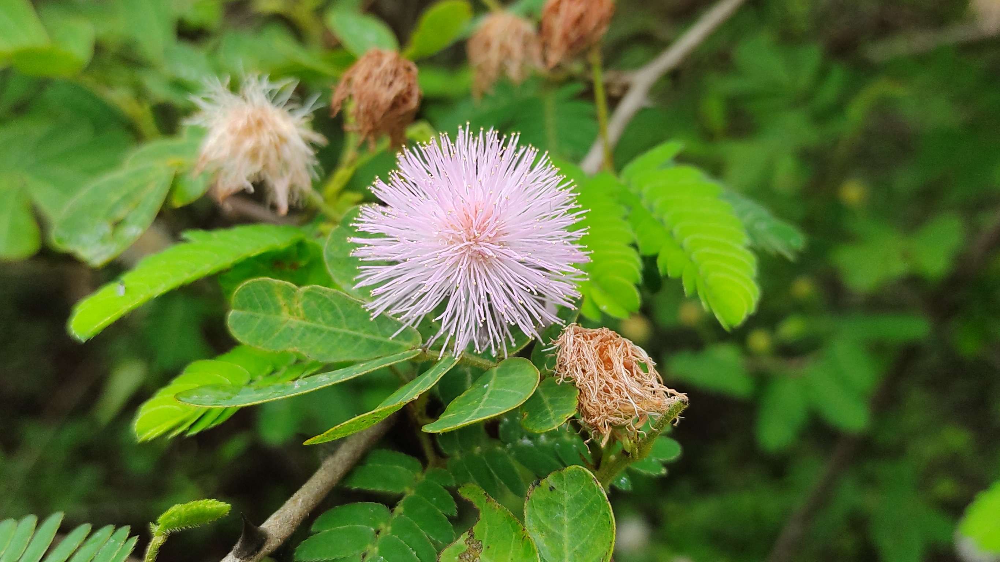

## Have you ever noticed the plants?

October, 2024

When I was outlining this blog, I wrote down a lot of ideas. I thought
about seeds, my PhD, how I got here, or maybe even telling the story of
a specific plant. But after many conversations, I realized I had to
start further back: with the plants themselves. Our society seems to
ignore them all the time. There's even a term that has become trendy
lately to describe this: **plant blindness**.

Plant blindness is the inability of humans to notice these green living
beings that surround us every day. Think about it: how many times have
you been walking and a cat crosses your path? You see the cat, but you
don't see the grass, the tree, the bush, the leaf, or the flower. They
are all part of the same landscape, yet we often ignore them as if they
were just background filler. Does this happen to you? It doesn't happen
to me---I'm a botanist and a plant biologist!

Still, you can also start to see them by becoming aware of what
wonderful organisms they are. Plants are **sessile**, meaning they
cannot move on their own (no, it doesn't count when you move the pot!).
This quality has forced them to develop incredible strategies to survive
environmental changes and become so successful that it remains a mystery
to evolutionary biologists why we have so many plant species.

Imagine this: if it rains, they can't take shelter. If the sun is too
intense, they can't seek shade. They don't dodge obstacles, and if you
build your house next to them, they have no choice but to become your
neighbors. But don't worry, you can overcome plant blindness. Just look
at them on your way and start to notice all their shapes, colors, and
smells. Try to guess what they're doing to survive in that corner where
you always see them.

I'm sure that after reading this, you'll start to see them. And I
haven't even mentioned oxygen and other ecosystem services yet!

Well, see you in November.

P.S.: I partially lied\... When they are seeds, they *do* move.
