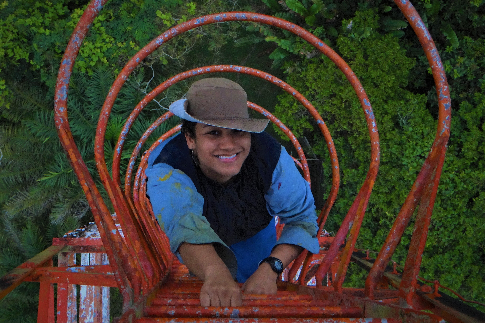

You can email me here: [vivianalondonolemos\@gmail.com](mailto:vivianalondonolemos@gmail.com){.email}

Follow me on:

<a href="https://bsky.app/profile/vivlondonol.bsky.social" style="background-color: #0077FF; color: white; padding: 5px 10px; text-decoration: none; border-radius: 5px; margin: 5px; display: inline-block;">bsky@vivlondonol</a>

<a href="https://www.researchgate.net/profile/Viviana-Londono-Lemos" style="background-color: #00CCBB; color: white; padding: 5px 10px; text-decoration: none; border-radius: 5px; margin: 5px; display: inline-block;">ResearchGate: Viviana-Londono-Lemos</a>

<a href="https://www.linkedin.com/in/viviana-londo%C3%B1o-lemos-9024b147/" style="background-color: #0A66C2; color: white; padding: 5px 10px; text-decoration: none; border-radius: 5px; margin: 5px; display: inline-block;">LinkedIn: Viviana-Londono-Lemos</a>

<a href="https://x.com/Vivlondonol" style="background-color: #1DA1F2; color: white; padding: 5px 10px; text-decoration: none; border-radius: 5px; margin: 5px; display: inline-block;">x@Vivlondonol</a>
