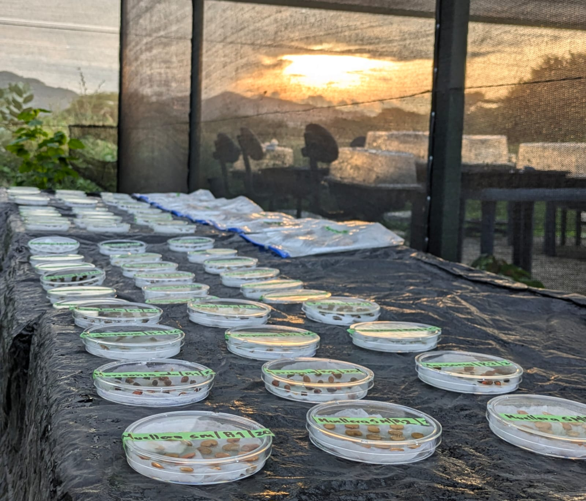

# Welcome to my website!

Hello, I am **Viviana Londoño-Lemos** (she/her), a PhD candidate in the Plant and Microbial Biology Program at the University of Minnesota, Twin Cities, USA. Here, you will find information on my background, contact info, and my blog, where you will learn about what I am up to and my path to becoming a tropical seed ecologist.

